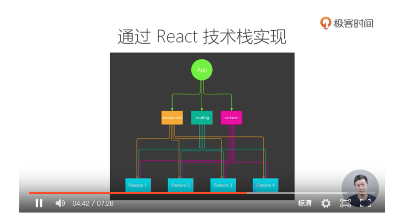
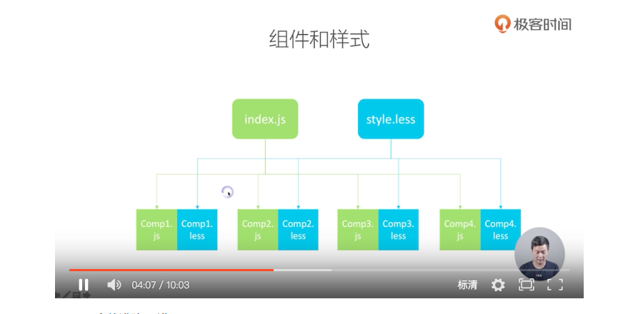
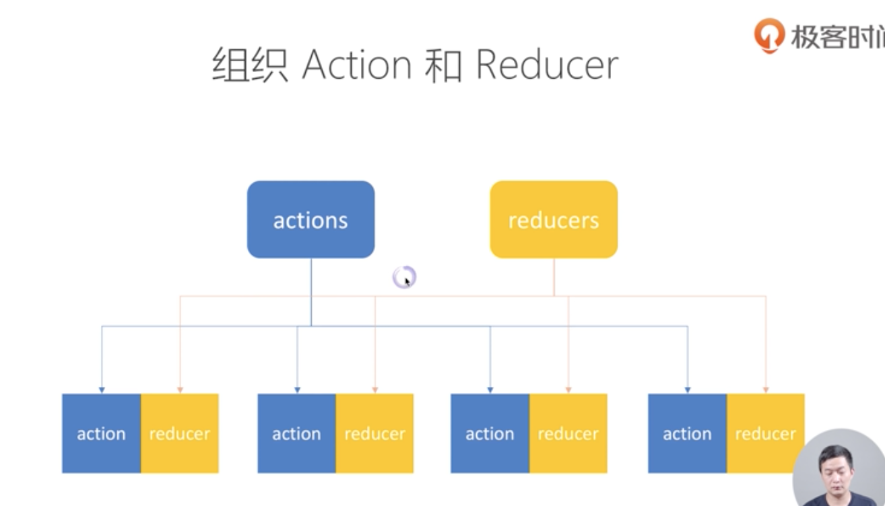

# FEE architecture for React

This article is note of three videos:

- basic concepts: https://time.geekbang.org/course/detail/100-11278
- code splitting by features: https://time.geekbang.org/course/detail/100-11279
- code splitting by react-router: https://time.geekbang.org/course/detail/100-11281

<br><br>

## 1. Basic concepts

The five features of idea frontend architecture:

- 1.Easy to maintain
- 2.Easy to extend
- 3.Easy to extend
- 4.Easy to test
- 5.Easy to construct

### Easy to maintain

There are three critical factors for easy maintenance or for choosing libs/tools.

- 1.development tools are robust or not
- 2.the prosperity of a development ecosystem
- 3.the community is active or not
- 4.There are three concerns

About code:

- 1.Are codes easy to understand?(create code standard/style)
- 2.Do we have good documentation

### Easy to extend

Two critical factors for easy to extend:

- 1.Is it easy to add new functionals?
- 2.Does the new feature significantly increase system complexity?

### Easy to test

- 1.Do we split the function/bussiness layers clearly?
- 2.Try to reduce side effect
- 3.Use pure function

### Easy to develop

### Easy to construct

- 1.Choose commonly used techniques and architectures
- 2.Choose construct tools(such as webpack)

<br><br>

## 2. How to split your code

### Code splitting by features

Code splitting by features is a way to reduce code coupling.

Most common react archtectures created by React building tools(such as create-react-app) are:

- components
- reducers
- actions

Whenever there are new functions are needed, we add files to one of the directories(components, reducers and actions). After project growing more complicated, the file structure of our project begins complicate.

At the first video, Pei Wan recommends splitting code by features.


<p style="text-align: center"><strong>Splitting code by features</strong></p>


<p style="text-align: center"><strong>technich view of code splittng by features/bussiness</strong></p>

<br><br>

## 3. How to organize components


<p style="text-align: center"><strong>How to organize components and its style file</strong></p>

When a component imported many times from the project, there will be repeat style of it. So, usually, we create a file called *style.scss/less* to import the styles of components we wanted in the entry file to avoid CSS style repeat.

## 4. How to organize your actions and reducers

Usually, we put the paired actions and reducers in the same place.



Take redux app Counter as an example,

In redux/counter.js

```javascript
import { INCREMENT, DECREMENT } from './constants'
export function minusOne () {
  return dispatch => {
    dispatch({
      type: DECREMENT,
      payload: 1
    })
    }
}

export function addOne () {
  return dispatch => {
    dispatch({
      type: INCREMENT,
      payload: 1
    })
  }
}

export function reducers (state, action) {
  switch(action.type) {
    case INCREMENT:
      return {
        ...state,
        count: state.count + action.payload
      }
    case DECREMENT:
      return {
        ...state,
        count: state.count - action.payload
      }
    default:
      return state
  }
}
````

After splitting redux into features, we can load our reducers and actions in root reducers.

### summaries

After splitting code by features, and organize components, reducers/actions, we can load actions/reducers in root reducers, actions.

The advantages of this strutures are:

- In every feature, resources are highly related
- Among features, interactions are low and less-couping.

By this solution, we can develop complicate FEE projects with easy maintain, esay to extend features.

<br><br>

## 5. How to organize *react-router* configurations

Define its router for a single features.


Organize *react-router* in a form of json.


### summary

- Every feature has its router config
- With top router configured by JSON, a project could be easy to extend and maintain
- How to resolve JSON of router config into React Router's grammar.