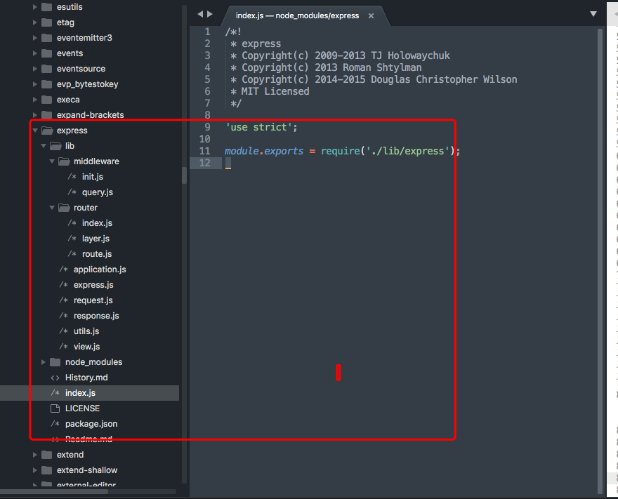

# express.js

express.js is a nodejs based web framework, it's esay to use and learn. The official guides are here:
- official site:  https://expressjs.com/
- github repo: https://github.com/expressjs/express

<br><br>
## Basic usage
express.js has a starter gennerate, which can help u build a basic application easily. More infomation can be found here. https://expressjs.com/en/starter/generator.html. <br>

### step 1:
Generally, a basic server applicaiton built with express is like following:

```javascript
// import express module
var express = require('express')
var logger = require('morgan')

var app = express();

// set static file path
app.use('/public',express.static(__dirname + '/public'))
// ad logger midleware
app.use(logger())
// set route for '/' path
app.get('/', function(req, res){
  res.send('Hello World');
})
// start the server
var server = app.listen(3000, function() {
  console.log('Listening on port %d', server.address().port);
})
```

### Step 2: 
Add route function to server. 
```javascript
const express = require('express')
const app = express()

const indexRouter = require('./router/index')
const usersRouter = require('./router/users')


app.use('/', indexRouter)
app.use('/users', usersRouter)

app.all('/', (req, res, next) => {
  res.json("welcome to my site!")
})

var server = app.listen(4400, function() {
  console.log('Listening on port %d', server.address().port);
})
```
<br>

Sample code for path '/users'
```javascript
const express = require('express')
const router = express.Router()

module.exports = router

router.get('/', (req, res, next) => {
  res.json({
    path: req.path,
    method: req.method
  })
})

router.get('/:id', (req, res, next) => {
   res.json({
    path: req.path,
    method: req.method,
    param: req.params['id']
  })
})
```
You might be wondering how express handle routing, setting and caching for app? Here we dive into the source code of express.js. <br><br>

## source code reading

#### Basically reading.
The code structure for express module


#### [express.js](./includes/01.express.js.md)

